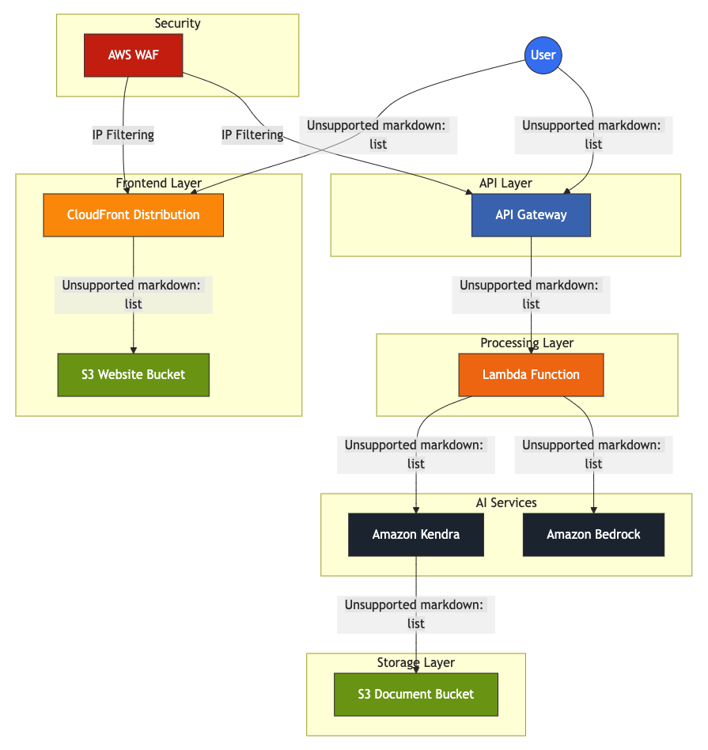

# PDF Document Chatbot

An AWS-powered solution that enables users to chat with and query their PDF documents using natural language.

## Overview

This project provides a complete infrastructure for a PDF document chatbot using AWS services. It allows users to upload PDF documents to a secure S3 bucket, which are then indexed by Amazon Kendra for intelligent search capabilities. Users can interact with a web interface to ask questions about their documents, and receive accurate responses powered by Amazon Bedrock (Claude) AI.

## Architecture

The solution uses the following AWS services:
- **Amazon S3** - For document storage and static website hosting
- **Amazon Kendra** - For intelligent document indexing and search
- **Amazon Bedrock** - For natural language processing using Claude models
- **AWS Lambda** - For serverless processing of queries
- **Amazon API Gateway** - For secure API endpoints
- **Amazon CloudFront** - For content delivery with WAF protection
- **AWS WAF** - For web application firewall security



## Features

- **Document Search**: Intelligent search through your documents using natural language queries
- **AI-Powered Responses**: Leverages Amazon Bedrock and Claude to provide accurate, context-aware answers
- **Secure Access**: IP-based access restrictions via AWS WAF and API Gateway resource policies
- **Responsive UI**: Clean, modern web interface for interacting with your documents

## Prerequisites

- AWS Account with appropriate permissions
- Terraform installed (v1.0+)
- AWS CLI installed and configured
- Access to Amazon Bedrock (may require requesting access in your AWS account)

## Deployment

1. Clone this repository:
```bash
git clone https://github.com/yourusername/pdf-document-chatbot.git
cd pdf-document-chatbot
```

2. Update the `terraform.tfvars` file with your preferred settings:
```hcl
region = "us-east-1"
project_name = "pdf-chatbot"
environment = "dev"
bedrock_model_id = "anthropic.claude-3-sonnet-20240229-v1:0"
kendra_edition = "DEVELOPER_EDITION"
lambda_memory_size = 512
lambda_timeout = 30
lambda_runtime = "python3.9"
```

3. Initialize and apply Terraform:
```bash
terraform init
terraform apply
```

4. After successful deployment, Terraform will output important information including:
   - Document bucket name (for uploading PDFs)
   - Website URL
   - API endpoint

## Usage

1. Upload PDF documents to the S3 document bucket:
```bash
aws s3 cp your-document.pdf s3://pdf-document-bucket-[random-id]/
```

2. Wait for Amazon Kendra to index your documents (may take a few minutes)

3. Access the web interface via the CloudFront URL from Terraform outputs

4. Ask questions about your documents using natural language

## Security Considerations

This solution includes several security measures:
- WAF IP whitelisting (only specified corporate IP ranges can access the application)
- Geographic restrictions (limited to specified countries)
- S3 bucket access controls
- API Gateway resource policies

## Cost Considerations

The main cost drivers for this solution are:
- Amazon Kendra (pricing varies by edition)
- Amazon Bedrock (pay-per-use)
- AWS Lambda invocations

Consider using the Kendra Developer Edition for testing purposes and monitor your usage carefully.

## Customization

You can customize various aspects of the deployment by modifying:
- `variables.tf` - To change default values
- `terraform.tfvars` - To override defaults
- `main.tf` - To add or modify resources
- `lambda_function.py` - To customize the backend logic
- `index.html` - To customize the web interface

## Contributing

Contributions are welcome! Please feel free to submit a Pull Request.

## License

This project is licensed under the MIT License - see the LICENSE file for details.
